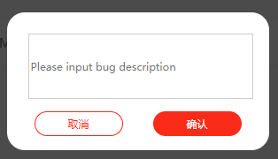

# deploy

$ yarn build && firebase deploy --only hosting

# WordStatus

-1 : bug

0 : learing

1 : done

# dialog



```
 showDialog({
                title: this.textSeleted,
                content: `
                <div class="dialog-content">${definition}</div>
                 <div class="dialog-content">${example}</div>
                `,
                onCancel,
                onOk
            });
```

import { showNotify } from'@nutui/nutui';

showNotify.success('Bug report submitted successfully');
